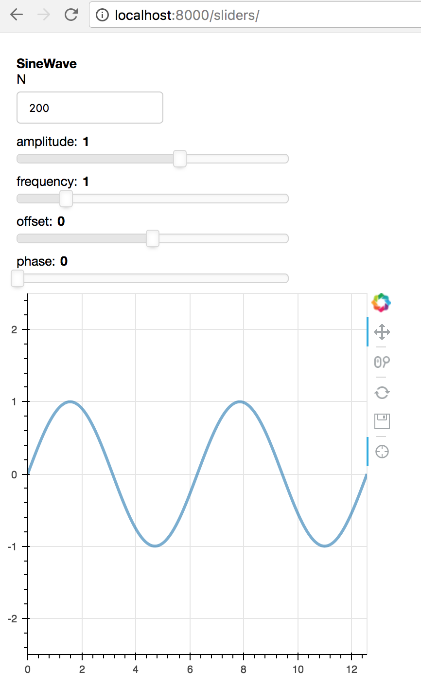

# Sample django + parambokeh apps

Demos showing how parambokeh can be integrated with django, to varying
degrees.

To install: `conda install "django=2"` (or install django your
preferred way).

## sliders

Based on
https://github.com/bokeh/bokeh/blob/master/examples/app/sliders.py,
the sliders app shows how to integrate parambokeh with a django view;
there's no interaction between param and django models.

To run: `python manage.py runserver`, then visit
http://localhost:8000/sliders

## polls

Based on https://docs.djangoproject.com/en/2.0/intro/tutorial01/, the
polls app shows one possible way to update a django model from a
parameterized object (displayed using parambokeh in a django view).

To run: `python manage.py migrate` (first time only, to create polls
models); subsequently run `python manage.py runserver` then visit
http://localhost:8000/polls

In the future, we could provide a way for people to integrate param
and django models.
